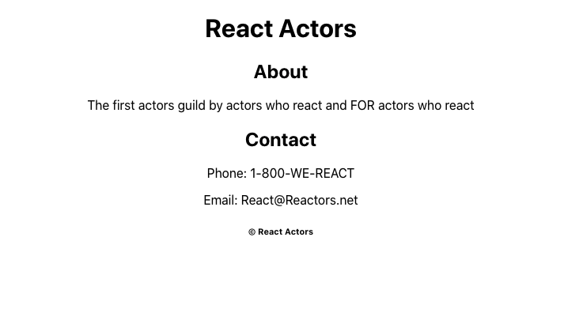

REACT ACTORS

## Description

Nightly week 10 react homework - Timeframe 2 hours

This project demonstrates the basics of building React.js components and using them to add Items to the dom

## Screen Shot

### Prerequisites

Link to software that is required to install the app (e.g. node).

- React.JS

## Installation

## Usage

1.  In console run: npm start to spool up server

2.  Open [http://localhost:3000](http://localhost:3000) to view it in the browser.
    -The page will reload if you make edits.

## Built With

React.js

## License

[MIT](https://choosealicense.com/licenses/mit/)

_Note, include this only if you have a license file. GitHub will generate one for you if you want!_

## Acknowledgement

Thanks to [Prime Digital Academy](www.primeacademy.io) who equipped and helped me to make this application a reality. Thanks Schmedan Wartz for all your help!
